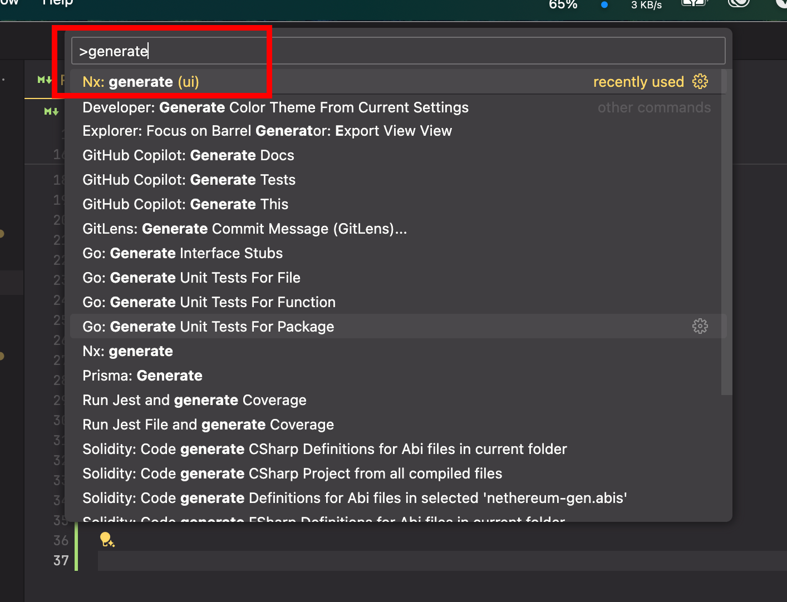
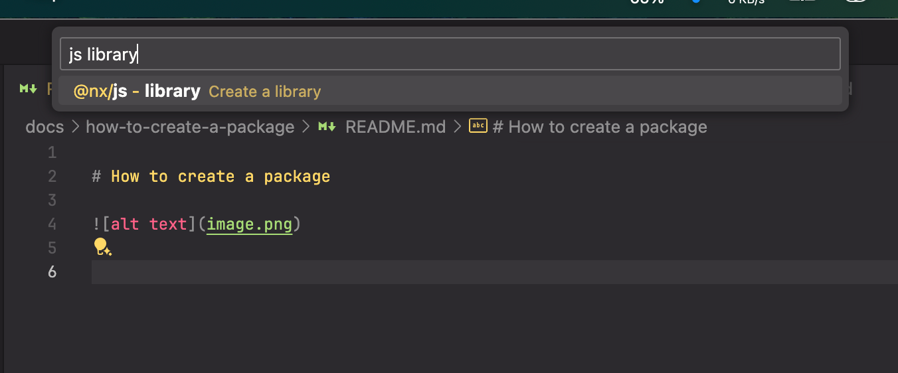
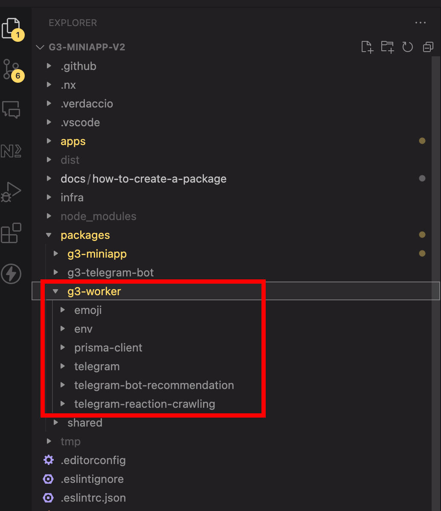
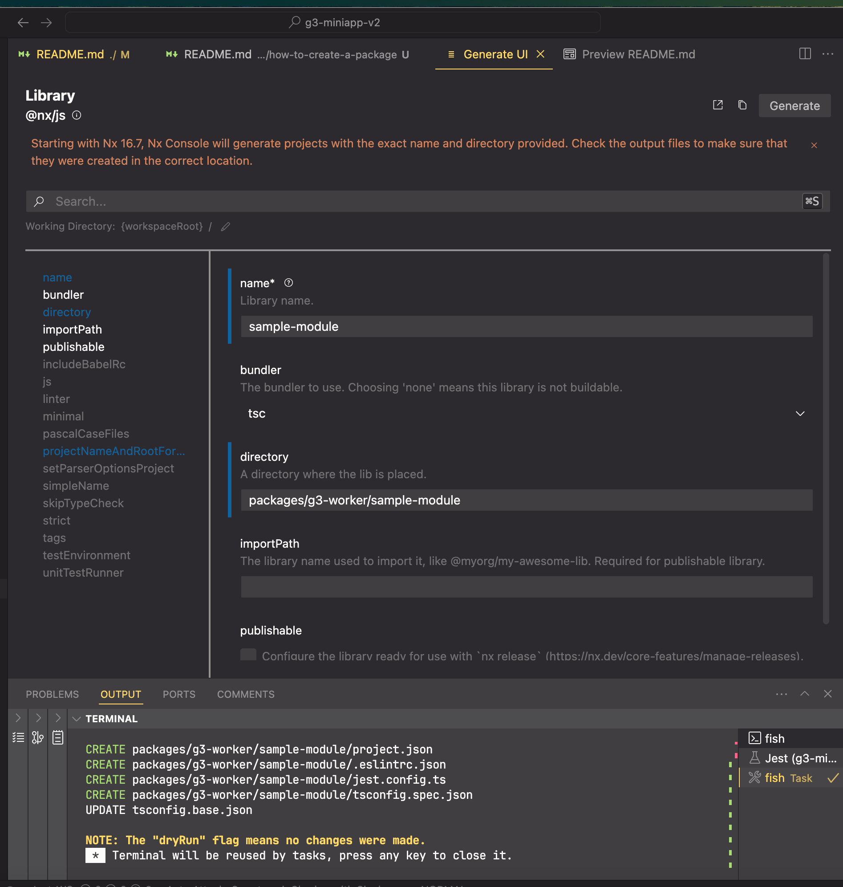
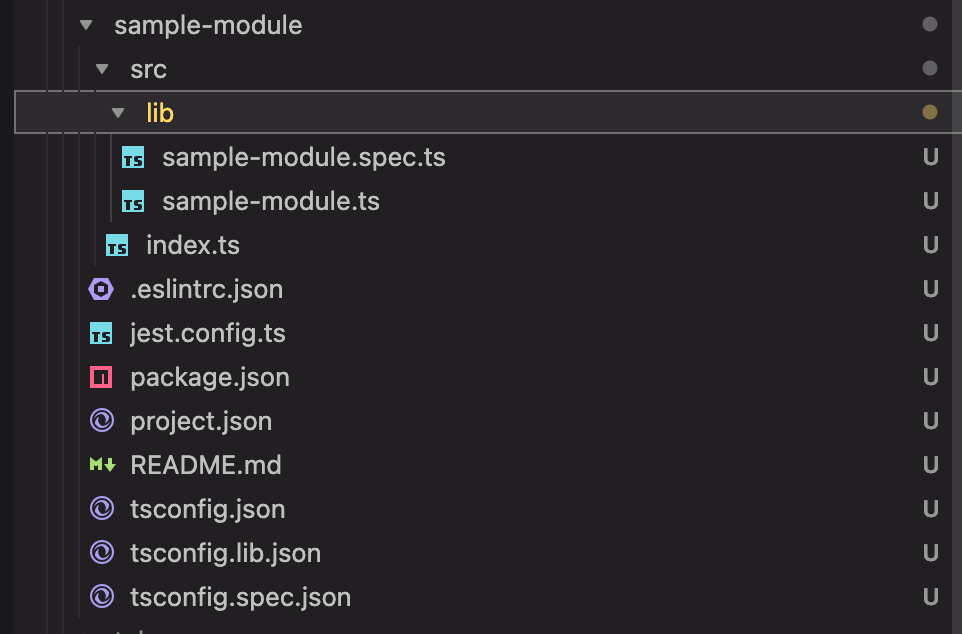
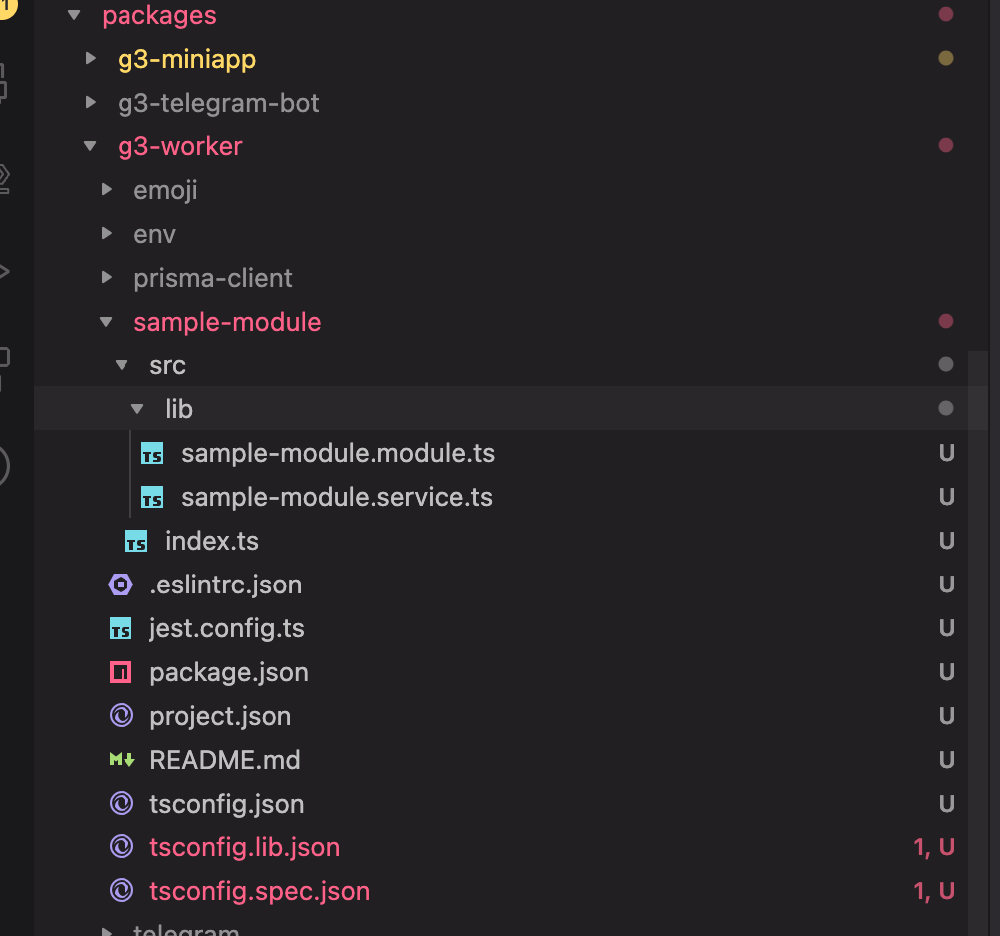
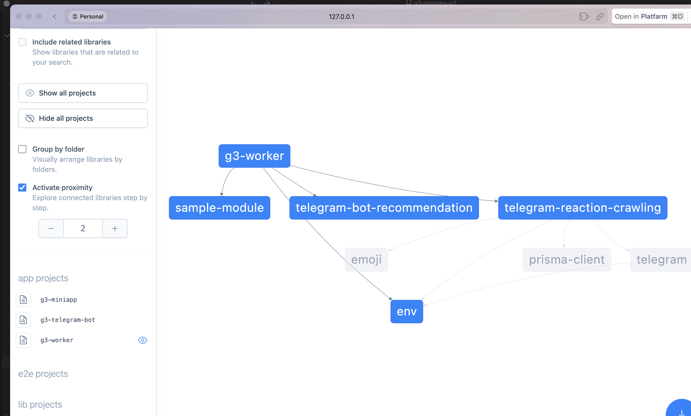

# How to create a package

|  |  |
| :---: | :---: |
| **Step 1** | **Step 2** |
|  |  |
| **Step 3** | **Step 4** |
|  |  |
| **Step 5** | **Make it look like this** |

With file content:

`index.ts`

```typescript
export * from './lib/sample-module.module';
export * from './lib/sample-module.service';
```


`sample-module.module.ts`

```typescript
import { Module } from '@nestjs/common';
import { SampleModuleService } from './sample-module.service';

@Module({
  providers: [SampleModuleService],
})
export class SampleModuleModule {}
```

`sample-module.service.ts`

```typescript
import { Injectable } from '@nestjs/common';

@Injectable()
export class SampleModuleService {
  getHello(): string {
    return 'Hello World!';
  }
}
```

Open `app.module.ts`:
  
```typescript
import { envSchema } from '@g3-worker/env';
import { TelegramReactionCrawlingModule } from '@g3-worker/telegram-reaction-crawling';
import { SampleModuleModule } from '@gall3ry/sample-module';
import { TelegramRecommendationModule } from '@gall3ry/telegram-bot-recommendation';
import { Module } from '@nestjs/common';
import { ConfigModule } from '@nestjs/config';
import { APP_FILTER } from '@nestjs/core';
import { ScheduleModule } from '@nestjs/schedule';
import { AllExceptionsFilter } from './http-exception.filter';

@Module({
  imports: [
    ScheduleModule.forRoot(),
    ConfigModule.forRoot({
      validate: (env) => envSchema.parse(env),
      isGlobal: true,
    }),
    TelegramReactionCrawlingModule,
    TelegramRecommendationModule,
    SampleModuleModule, // Add this line
  ],
  providers: [
    {
      provide: APP_FILTER,
      useClass: AllExceptionsFilter,
    },
  ],
})
export class AppModule {}
```

Running `pnpm nx graph --web`:


